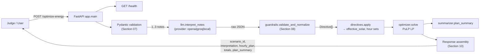
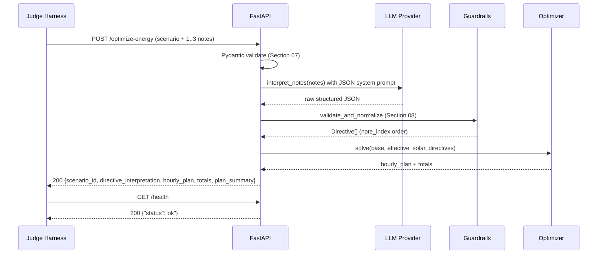

## Plan: GridWise Preliminary Build Plan

The Problem Statement is the canonical contract (Section 12). The Participant Guide governs deployment/scoring. The public sample JSON is for local validation only — the judge uses hidden paraphrased notes. This plan builds the full pipeline: `LLM interpretation → deterministic guardrails → LP optimizer → response assembly`, plus the supporting artifacts (README, Docker, video).

**Steps**

1. **Read the canonical inputs end-to-end (depends on nothing).**
   - Skim `BUP_CSE_FEST_2026_Preliminary_Problem_Statement_GridWise_LLM.pdf` (sections 04, 08, 09, 10, 11 are the source of truth for directive types, guardrails, battery rules, and response schema).
   - Skim `BUP_CSE_FEST_2026_Participant_Guide_&_Evaluation_Rubric_GridWise_LLM.pdf` for deliverables (Section 02), scoring (Section 07), and tie-break order (Section 10).
   - Open `BUP_CSE_FEST_2026_Preli_Public_Sample_Cases.json` and use it as the running fixture for every test below.

2. **Initialize the repo (depends on 1).**
   - Create `gridwise/` on Windows with: `app/main.py`, `app/schemas.py`, `app/llm.py`, `app/guardrails.py`, `app/optimizer.py`, `app/directives.py`, `app/summarizer.py`, `app/__init__.py`.
   - Add `requirements.txt` (fastapi, uvicorn, pydantic, httpx, pulp, python-dotenv, pytest), `Dockerfile`, `.dockerignore`, `.env.example`, `.gitignore` (block `.env`, `__pycache__`, `.venv`), and an empty `README.md`.
   - Choose a Python 3.11+ venv; document it in README.

3. **Define Pydantic request/response schemas in `app/schemas.py` (depends on 2). Mirror Sections 07 and 10 of the Problem Statement exactly.**
   - `ScenarioIn`: `scenario_id: str`, `operator_notes: List[str]` length-validated to 1–3, `hours: List[Hour]` length-validated to exactly 24, `battery: Battery`.
   - `Hour`: `hour` (0–23), `demand_kwh` (≥0), `solar_kwh` (≥0), `tariff_bdt_per_kwh` (≥0).
   - `Battery`: `capacity_kwh`, `initial_energy_kwh`, `minimum_energy_kwh`, `max_charge_kwh_per_hour`, `max_discharge_kwh_per_hour` (all ≥0, with cross-field validators).
   - `DirectiveInterpretation`: `note_index`, `applies`, `directive_type` (Literal of the 6 types), `structured_adjustment` (model per type, or `None`), `explanation`.
   - `HourlyPlan`: `hour`, `grid_kwh`, `solar_used_kwh`, `battery_action` (Literal `charge|discharge|idle`), `battery_kwh`, `battery_energy_after_kwh`.
   - `ResponseOut`: `scenario_id`, `directive_interpretation: List[DirectiveInterpretation]` (must equal len(notes) and be in `note_index` order), `hourly_plan: List[HourlyPlan]` (exactly 24, hours 0–23, ascending, unique), `total_grid_kwh`, `total_cost_bdt`, `peak_grid_kwh`, `plan_summary`.

4. **Implement the LLM interpreter in `app/llm.py` (depends on 3). The LLM is mandatory on the interpretation path.**
   - Provider abstraction (`interpret_notes(notes) -> list[dict]`) with three backends toggled by `LLM_PROVIDER` env var:
     - `openai` (default; model `gpt-4o-mini`, `OPENAI_API_KEY`).
     - `groq` (model `llama-3.1-70b-versatile`, `GROQ_API_KEY`) — cheap + fast fallback.
     - `local` (Ollama HTTP API, e.g. `llama3.1:8b-instruct-q5_K_M`).
   - Strict system prompt: returns ONLY a JSON array of length N, one entry per note, with keys `note_index, applies, directive_type, structured_adjustment, explanation`. Allowed `directive_type` values: `solar_reduction | minimum_battery_reserve | no_charge_window | no_discharge_window | max_grid_window | no_op`.
   - Few-shot examples inside the prompt covering: solar reduction with whole-hour window, no-charge window, reserve with kWh value, irrelevant distractor → no_op, and a paraphrased solar-reduction example from Section 11.4.
   - Use `response_format={"type":"json_object"}` (or provider equivalent) and retry once on JSON parse failure before falling back to deterministic defaults (see step 5).
   - Log only non-sensitive fields (note_index, directive_type, applies); never log the raw prompt containing API keys.

5. **Build the deterministic guardrails in `app/guardrails.py` (depends on 4). This is the single source of truth — the LLM output is untrusted until it passes.**
   - Function `validate_and_normalize(raw_list, n_notes) -> List[DirectiveInterpretation]`:
     - Length must equal `n_notes`; pad with `no_op` entries if missing; trim duplicates; sort by `note_index`.
     - Allowed types whitelist (the 6 from Section 4.1). Any unknown type → coerce to `no_op`.
     - `applies` rule: `applies=False` iff `directive_type == "no_op"`. Any other directive forces `applies=True`. Mismatch → coerce (set `applies=True` and keep type, or fall back to `no_op` on conflicting signals).
     - `structured_adjustment` shape per type:
       - `solar_reduction`: `{"hours": List[int], "factor": float}` → hours sorted ascending, unique, in `[0,23]`; `factor` clamped to `[0,1]`.
       - `minimum_battery_reserve`: `{"hours": List[int], "minimum_energy_kwh": float}` → hours normalized; reserve clamped to `[0, battery.capacity_kwh]`.
       - `no_charge_window` / `no_discharge_window`: `{"hours": List[int]}` → hours normalized.
       - `max_grid_window`: `{"hours": List[int], "max_grid_kwh": float}` → hours normalized; cap clamped to `≥0`.
       - `no_op`: `structured_adjustment = null`.
     - Numeric tolerance pass: reject NaN/inf; round to 4 decimals.
   - Expose `Directive` dataclasses in `app/directives.py` so the optimizer consumes already-normalized objects.

6. **Apply directives to the problem in `app/directives.py` (depends on 5).**
   - `effective_solar[h] = base_solar[h]` then for each `solar_reduction` set `effective_solar[h] *= factor` over its hours.
   - Collect `min_reserve_by_hour[h] = max(base_minimum, directive_minimum)` from `minimum_battery_reserve`.
   - Collect `no_charge_hours`, `no_discharge_hours` as boolean sets.
   - Collect `max_grid_by_hour[h]` from `max_grid_window` (default = `+inf`).

7. **Build the optimizer in `app/optimizer.py` (depends on 6). Use PuLP as the primary solver; greedy DP as the documented fallback.**
   - Decision variables per hour h:
     - `g[h] ≥ 0` (grid import kWh)
     - `s[h] ≥ 0` (solar used kWh), bounded by `effective_solar[h]`
     - `c[h] ≥ 0` (charge kWh), bounded by `max_charge_kwh_per_hour` and 0 in `no_charge_hours`
     - `d[h] ≥ 0` (discharge kWh), bounded by `max_discharge_kwh_per_hour` and 0 in `no_discharge_hours`
     - `E[h]` (battery energy after hour h), with `E[0] = initial_energy_kwh` (implemented by substitution `E[h] = E0 + Σ(c[i]-d[i])`).
   - Constraints:
     - Energy balance: `g[h] + s[h] + d[h] == demand[h] + c[h]` for each h.
     - Bounds: `0 ≤ E[h] ≤ capacity_kwh` and `E[h] ≥ max(minimum_energy_kwh, min_reserve_by_hour[h])` for each h.
     - End-of-day neutrality: `Σ(c[h] - d[h]) == 0` (i.e., `E[23] == initial_energy_kwh`).
     - Grid cap: `g[h] ≤ max_grid_by_hour[h]` where defined.
     - Force exactly one `battery_action`: introduce binary `y_charge[h], y_discharge[h]` with `c[h] ≤ M·y_charge[h]`, `d[h] ≤ M·y_discharge[h]`, `y_charge[h] + y_discharge[h] ≤ 1`, and at most one of c/d > 0 in any hour. (M = `max_charge_kwh_per_hour + max_discharge_kwh_per_hour`.)
   - Objective: minimize `Σ g[h] * tariff[h]`.
   - Solve with PuLP default CBC; on infeasibility, return HTTP 422 with a controlled message. On success, round to 4 decimals, classify `battery_action` per hour, and recompute `peak_grid_kwh`, `total_grid_kwh`, `total_cost_bdt` server-side.

8. **Generate the human-readable plan summary in `app/summarizer.py` (depends on 7). Cosmetic only — does not affect scoring.**
   - String template listing applied directives (e.g., "Reduced solar to 20% during hours 13–14; enforced no-charge window 14–15; maintained ≥120 kWh reserve during 18–20."). No use of the LLM is required here, and using one is permitted only as a thin wrapper.

9. **Wire the FastAPI app in `app/main.py` (depends on 3–8).**
   - `GET /health` → `{"status": "ok"}`; readiness must complete within 60 s of process start.
   - `POST /optimize-energy` pipeline: validate → interpret (LLM) → guardrails → apply directives → optimize → assemble response. Per-request timeout budget: 30 s (LLM call ≤ 20 s, optimize ≤ 8 s, other ≤ 2 s). Return 400 on schema errors, 422 on infeasibility, 500 on unexpected failure (no stack traces leaked).
   - Add `lifespan` startup that warms the LLM client and runs a tiny dummy inference to avoid cold-start failures during judging.
   - Cross-origin and any global error handler must scrub secrets/stack traces.

10. **Local validation (depends on 9).**
    - `tests/test_public_sample.py` loads each case from `BUP_CSE_FEST_2026_Preli_Public_Sample_Cases.json`, hits `POST /optimize-energy`, and asserts: response schema, exactly N interpretations in note_index order, `no_op` semantics, hour uniqueness, end-of-day neutrality, energy balance within 0.01 kWh tolerance, totals self-consistency.
    - `tests/test_guardrails.py` covers paraphrased solar-reduction variants, NaN/inf rejection, out-of-range hours, contradictory window shapes, and malformed LLM JSON (mocked).
    - `tests/test_optimizer.py` runs hand-constructed cases (e.g., no-solar/no-directive baseline, single solar_reduction, single no_charge_window, max_grid_window = 0) and verifies battery bounds, rate limits, neutrality, and that cost ≥ a hand-derived lower bound.
    - Run `uvicorn app.main:app --port 8000`, then `curl /health` and a public sample request; confirm p95 < 5 s locally.

11. **Write the self-contained `README.md` (depends on 10). Required by Section 02 / Section 05.**
    - Sections: Overview · Architecture diagram (ASCII or mermaid of `Note → LLM → Guardrails → Directives → Optimizer → Plan`) · Setup · Env vars (`OPENAI_API_KEY`, `GROQ_API_KEY`, `LLM_PROVIDER`, `PORT`) · Exact run command · `curl /health` and `curl /optimize-energy` examples · Public sample test command · LLM role + guardrails summary · Optimizer/solver notes · Docker run command · Dependencies · Known limitations · Secrets policy (no committed values). Credit all libraries.

12. **Build the Docker fallback (depends on 11).**
    - `Dockerfile` based on `python:3.11-slim`, installs requirements, exposes `PORT` (default 8000), binds `0.0.0.0`, runs `uvicorn app.main:app --host 0.0.0.0 --port $PORT`. No secrets baked in — read from environment at runtime.
    - `.dockerignore` excludes `.env`, `.venv`, `.git`, `tests/`.
    - Build and run locally: `docker build -t gridwise:local . && docker run --rm -p 8000:8000 --env-file .env gridwise:local`. Verify `/health` from another shell.
    - Tag `gridwise:v1` (or a digest) and push to Docker Hub / GHCR. Record the exact `docker run` command and the image reference for submission.

13. **Deploy a reachable public endpoint (depends on 12). Best option for the 4-hour window: Render/Railway/Fly.io with the same Dockerfile and env vars; HF Spaces is also fine.**
    - Set environment variables in the host (no secrets in repo).
    - From a second machine/phone, hit `GET /health` and one public-sample `POST /optimize-energy` to confirm reachability.
    - Keep the service running through the judging window; note the base URL for submission.

14. **Record the 3-minute architecture video (depends on 11). Tie-break only — no base points.**
    - Outline (≤3:00): problem recap · architecture diagram (`LLM → Guardrails → Directives → Optimizer`) · key implementation choices (PuLP, Pydantic, paraphrase prompt) · live demo of `/health` + one public sample · known limitations. Record with OBS/phone; export ≤3 min MP4; upload to Drive/YouTube (unlisted) and capture the organizer-accessible link.

15. **Pre-submit checks (depends on 13, 14). Re-run the checklist from Participant Guide Section 05 / Section 11.**
    - [ ] `/health` returns `{"status":"ok"}` externally.
    - [ ] `/optimize-energy` accepts 1–3 notes and returns the exact schema; `directive_interpretation` length = N in note_index order.
    - [ ] `no_op` cases use `applies=false, structured_adjustment=null`; all others use `applies=true` with the correct shape.
    - [ ] Hours unique 0–23 ascending; solar factor in [0,1]; reserves within capacity; grid caps finite.
    - [ ] Public sample total_grid_kwh / total_cost_bdt / peak_grid_kwh match a recomputation.
    - [ ] Battery end-of-day = initial; energy balance holds within 0.01 kWh on every hour of every public sample.
    - [ ] p95 < 5 s on repeated requests; service stable after malformed/edge inputs.
    - [ ] Repo private during event, public after the deadline; no secrets committed.
    - [ ] Docker image is pullable from the documented registry reference; `docker run` command reaches `/health`; no baked-in secrets.
    - [ ] README reproducible from a clean machine.
    - [ ] Video accessible, ≤3:00.

16. **Submission package (depends on 15). Send to organizers using the form provided in the Participant Guide Section 02.**
    - Public base URL for `/health` and `/optimize-energy`.
    - GitHub repo URL (private during event, public after deadline).
    - README + sample request/response.
    - Docker fallback image registry reference + tag/digest + verified `docker run` command.
    - 3-minute video link.
    - Model/provider or local model identifier; required env-var names; solver/library names.

**Relevant files**

- `BUP_CSE_FEST_2026_Preliminary_Problem_Statement_GridWise_LLM.pdf` — canonical source for endpoint names, directive types (`solar_reduction | minimum_battery_reserve | no_charge_window | no_discharge_window | max_grid_window | no_op`), guardrails (Section 08), battery/energy rules (Section 09), request/response schema (Sections 07, 10), validation rules (Section 11). **Conflicts resolved in favor of this document.**
- `BUP_CSE_FEST_2026_Participant_Guide_&_Evaluation_Rubric_GridWise_LLM.pdf` — canonical source for deliverables (Section 02), evaluation weights (Section 06/07), performance/reliability thresholds (`/health` ≤60 s, request ≤30 s, p95 ≤5 s), Docker fallback rules, and tie-break order.
- `BUP_CSE_FEST_2026_Preli_Public_Sample_Cases.json` — public fixtures used by every test in step 10.
- New code (to be created in `gridwise/`): `app/main.py`, `app/schemas.py`, `app/llm.py`, `app/guardrails.py`, `app/directives.py`, `app/optimizer.py`, `app/summarizer.py`, `requirements.txt`, `Dockerfile`, `.dockerignore`, `.env.example`, `.gitignore`, `README.md`, `tests/`.

**Diagrams**

Architecture:

End-to-end request flow:

**Verification**

1. `pytest -q` — all `tests/test_public_sample.py`, `tests/test_guardrails.py`, `tests/test_optimizer.py` pass; energy balance and end-of-day neutrality hold within 0.01 kWh.
2. `curl http://localhost:8000/health` → `{"status":"ok"}` returned within 60 s of process start.
3. For every case in `BUP_CSE_FEST_2026_Preli_Public_Sample_Cases.json`, the response has `len(directive_interpretation) == len(operator_notes)` in `note_index` order, every `no_op` uses `applies=false` + `null` adjustment, every other directive uses `applies=true` + the required shape, and `hourly_plan` has exactly 24 unique hours 0–23 ascending.
4. Recompute totals from `hourly_plan`; assert `abs(server.total_grid_kwh - recomputed) < 0.01` and likewise for `total_cost_bdt` and `peak_grid_kwh`.
5. Local benchmark: 10 sequential `/optimize-energy` calls → p95 latency < 5 s; no 5xx responses.
6. `docker build -t gridwise:local . && docker run --rm -p 8000:8000 --env-file .env gridwise:local` → `curl /health` succeeds from a second terminal; image contains no `.env` (verified with `docker run --rm gridwise:local printenv | grep -E 'KEY|SECRET|TOKEN'` returns nothing).
7. External reachability: from a different network, both `/health` and one public-sample request succeed against the deployed base URL.
8. Repository audit: `git log` shows creation after question reveal; no committed `.env`, keys, tokens, or raw secret-bearing prompts; `README.md` is self-contained and reproduces steps 1–7 from a clean clone.
